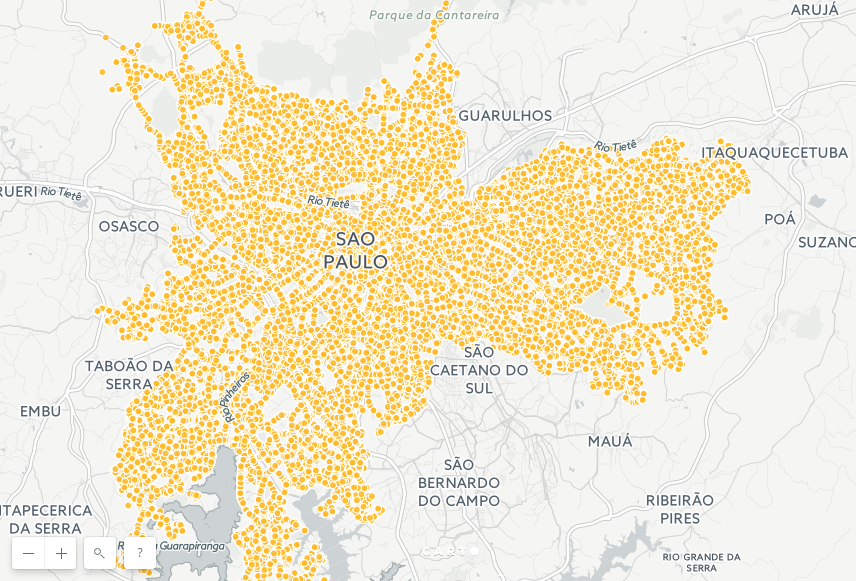

# MoniBus

## Origem dos dados
Todas as informações disponibilizadas pela API MoniBus foram extraídas diretamente da [API Olho Vivo](http://olhovivo.sptrans.com.br/).

```json
{
   "hr":"12:51",
   "vs":[
      {
         "p":"72944",
         "a":true,
         "py":-23.661334500000002,
         "px":-46.768457749999996
      }
   ]
}
```

Inicialmente, um script Python 3.5 foi usado para receber dados minuto a minuto, o [Crawler-OlhoVivo](https://github.com/laurybueno/Crawler-OlhoVivo). Os arquivos JSON obtidos eram então importados pela plataforma Django.

Atualmente, o processo todo é feito via Django e os dados são armazendos em um banco de dados PostGIS.

## Sobre os dados
Uma amostra dos dados armazenados está disponível para análise exploratória [no CartoDB](https://laurybueno.carto.com/builder/0828ce18-ab57-4681-8655-2d6b0146818f/).




## Dados via API
O ponto de saída desses dados é o endereço https://monibus.laury.me/api/registro pelo método HTTP GET. Os filtros disponíveis podem ser usados em conjunto ou separadamente e são eles:

- “p”: código do veículo

- “codigoLinha”: código da linha segundo o padrão de bancos de dados internos da SPTrans. Para encontrar esse número é preciso ou fazer uma busca na API oficial da SPTrans ou consultar o arquivo GTFS também disponibilizado pela empresa pública

- “a”: veículo buscado tem acessibilidade para pessoas com mobilidade reduzida. Valores possíveis são “true” e “false”

- “hr”: horário oficial desse registro dado pela API da SPTrans no momento da coleta do dado

- “data”: data e horário em que a coleta foi de fato realizada. Esse campo usa o formato de representação de data ISO 8601. Exemplo: “2017-04-26T12:59:00.868132Z”

- “data_lte”: busca todos os registros com data e horário menor do que o especificado

- “data_gte”: busca todos os registros com data e horário maior do que o especificado

Os dados retornados seguem a especificação aberta GeoJSON.

## Contexto
A malha de transporte público viário na cidade de São Paulo teve quase 3 bilhões de transportes de passageiros em 2016 e é operada exclusivamente por empresas privadas.

Entre consórcios e cooperativas, 16 organizações são responsáveis pelos 15 mil veículos e 1.300 linhas que atendem a capital paulista. O papel estatal nessa relação é cumprido pela São Paulo Transporte S.A. (SPTrans), que gere licitações e acompanha a atuação empresarial no transporte.

Nesse ínterim, foi criada a API Olho Vivo que torna pública a posição geográfica de todos os ônibus em circulação na cidade. A partir desses dados, vários empreendimentos como “Cadê o ônibus” e “Trafi” passaram a oferecer interfaces para dar ao público acesso a esses dados.  Por meio desses, é possível acompanhar o transporte público com aplicações móveis e saber quando ônibus realmente vão passar por pontos pela cidade com alguns minutos de antecedência.

Apesar de conveniente, essas interfaces, assim como a API oficial, não oferecem uma visão geral da situação e do gerenciamento do transporte público em São Paulo. Não há séries históricas desse mapeamento, nem dados sumarizados sobre essas movimentações que facilitem a extração de conclusões sobre a execução desse serviço.
